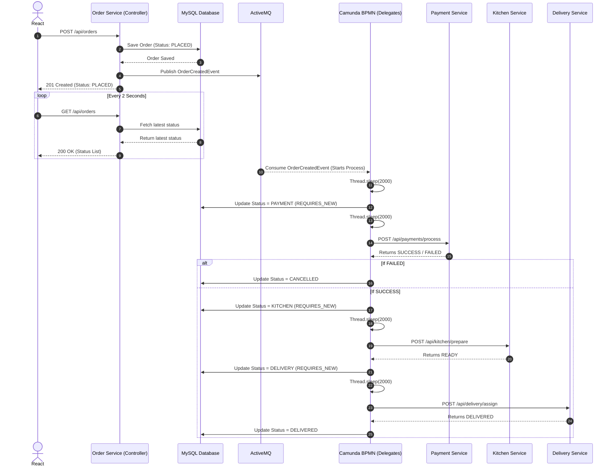

# API Low-Level Design: Online Food Order Processing System

## 1. System Overview

The Online Food Order Processing System is an event-driven, microservices-based application orchestrating a food delivery workflow. 

**Architecture Highlights:**
- **Frontend:** React application that provides the user interface and uses short-polling (every 2 seconds) to track order statuses in real-time.
- **Backend Microservices (Spring Boot):**
  - **Order Service (Port 8081):** Central orchestrator. Manages the `Order` database, hosts the Camunda BPMN engine, and serves the frontend REST APIs.
  - **Payment Service (Port 8082):** Simulates payment processing with an 80% success rate.
  - **Kitchen Service (Port 8083):** Simulates food preparation and kitchen ticketing.
  - **Delivery Service (Port 8084):** Simulates driver assignment and delivery dispatch.
- **Message Broker (ActiveMQ):** Decouples order creation from workflow execution. The Order Service publishes an event to ActiveMQ, which then asynchronously triggers the Camunda workflow.
- **Orchestration (Camunda BPMN):** Manages the complex state machine and sequence of the order lifecycle (`Payment` → `Kitchen` → `Delivery`), enforcing transaction boundaries and asynchronous execution.

---

## 2. REST APIs

### 2.1 Order Service

#### 1. Create Order
- **Service Name:** Order Service
- **Endpoint URL:** `/api/orders`
- **HTTP Method:** `POST`
- **Purpose:** Creates a new order, saves it with `PLACED` status, and publishes an `OrderCreatedEvent` to ActiveMQ.
- **Request Headers:** `Content-Type: application/json`
- **Request Body:**
  ```json
  {
    "customerName": "John Doe",
    "item": "Pizza",
    "amount": 199
  }
  ```
- **Response Body:**
  ```json
  {
    "id": 1,
    "customerName": "John Doe",
    "item": "Pizza",
    "amount": 199,
    "status": "PLACED"
  }
  ```
- **HTTP Status Codes:** `201 Created`
- **Validation Rules:** None explicitly enforced by annotations, but relies on valid JSON casting to DTO types.
- **Error Responses:** 
  - `500 Internal Server Error` (e.g., Database failure, ActiveMQ serialization failure).

#### 2. Get All Orders
- **Service Name:** Order Service
- **Endpoint URL:** `/api/orders`
- **HTTP Method:** `GET`
- **Purpose:** Fetches all orders sorted by ID in descending order (most recent first). Used by React polling.
- **Request Headers:** None
- **Request Body:** None
- **Response Body:**
  ```json
  [
    {
      "id": 1,
      "customerName": "John Doe",
      "item": "Pizza",
      "amount": 199,
      "status": "PLACED"
    }
  ]
  ```
- **HTTP Status Codes:** `200 OK`
- **Validation Rules:** N/A
- **Error Responses:** `500 Internal Server Error`

#### 3. Get Order By ID
- **Service Name:** Order Service
- **Endpoint URL:** `/api/orders/{id}`
- **HTTP Method:** `GET`
- **Purpose:** Retrieves the details of a single order.
- **Request Headers:** None
- **Request Body:** None
- **Response Body:** (Same as Create Order response)
- **HTTP Status Codes:** `200 OK`, `404 Not Found`
- **Validation Rules:** Path variable `{id}` must be numeric.
- **Error Responses:** 
  - `404 Not Found`: 
    ```json
    { "message": "Order not found" }
    ```

### 2.2 Payment Service

#### 4. Process Payment
- **Service Name:** Payment Service
- **Endpoint URL:** `/api/payments/process`
- **HTTP Method:** `POST`
- **Purpose:** Simulates payment processing (80% success rate).
- **Request Headers:** `Content-Type: application/json`
- **Request Body:**
  ```json
  {
    "orderId": 1,
    "amount": 199
  }
  ```
- **Response Body:**
  ```json
  {
    "orderId": 1,
    "status": "SUCCESS" // or "FAILED"
  }
  ```
- **HTTP Status Codes:** `200 OK`
- **Validation Rules:** Relies on matching DTO schema.
- **Error Responses:** `500 Internal Server Error`

### 2.3 Kitchen Service

#### 5. Prepare Food
- **Service Name:** Kitchen Service
- **Endpoint URL:** `/api/kitchen/prepare`
- **HTTP Method:** `POST`
- **Purpose:** Simulates kitchen preparation, generating a random prep time (5-20 mins).
- **Request Headers:** `Content-Type: application/json`
- **Request Body:**
  ```json
  {
    "orderId": 1
  }
  ```
- **Response Body:**
  ```json
  {
    "orderId": 1,
    "status": "READY",
    "prepTimeMinutes": 12
  }
  ```
- **HTTP Status Codes:** `200 OK`
- **Validation Rules:** None
- **Error Responses:** `500 Internal Server Error`

### 2.4 Delivery Service

#### 6. Assign Driver
- **Service Name:** Delivery Service
- **Endpoint URL:** `/api/delivery/assign`
- **HTTP Method:** `POST`
- **Purpose:** Assigns a random driver to deliver the prepared food.
- **Request Headers:** `Content-Type: application/json`
- **Request Body:**
  ```json
  {
    "orderId": 1
  }
  ```
- **Response Body:**
  ```json
  {
    "orderId": 1,
    "driverName": "Ravi",
    "status": "DELIVERED"
  }
  ```
- **HTTP Status Codes:** `200 OK`
- **Validation Rules:** None
- **Error Responses:** `500 Internal Server Error`

---

## 3. ActiveMQ Queue Design

- **Queue Name:** `order.created`
- **Producer:** `OrderController` (via `JmsTemplate`)
- **Consumer:** `OrderCreatedConsumer` (via `@JmsListener`)
- **Message Payload:** `OrderCreatedEvent`
- **Sample JSON Message:**
  ```json
  {
    "orderId": 1,
    "customerName": "John Doe",
    "item": "Pizza",
    "amount": 199,
    "status": "PLACED"
  }
  ```
- **Queue Purpose:** To asynchronously trigger the Camunda orchestrator without blocking the HTTP response of the initial `POST /api/orders` call.

---

## 4. Camunda Workflow

**Process ID:** `order-process`

**Process Variables:**
- `orderId` (Long)
- `paymentStatus` (String: "SUCCESS" | "FAILED")

**Workflow Steps:**
1. **Start Event:** Triggered programmatically by the `OrderCreatedConsumer` upon reading the ActiveMQ queue.
2. **Payment Service Task (`PaymentDelegate`):** 
   - Halts for 2 seconds (`Thread.sleep`) allowing frontend polling to capture the initial `PLACED` status.
   - Uses a `TransactionTemplate` with `REQUIRES_NEW` to immediately commit a status update to `PAYMENT`.
   - Halts for another 2 seconds (`Thread.sleep`) allowing frontend polling to capture the `PAYMENT` status.
   - Synchronously calls `POST /api/payments/process`.
   - Saves `paymentStatus` variable.
3. **Exclusive Gateway (`Payment Result?`):**
   - **Failure Flow:** If `${paymentStatus == 'FAILED'}`, routes to `CancelTask` (`CancelOrderDelegate`) which marks the order as `CANCELLED` and terminates the workflow.
   - **Success Flow:** If `${paymentStatus == 'SUCCESS'}`, routes to the `KitchenTask`.
4. **Kitchen Service Task (`KitchenDelegate`):**
   - Immediately commits status `KITCHEN`, sleeps 2s, and calls `POST /api/kitchen/prepare`.
5. **Delivery Service Task (`DeliveryDelegate`):**
   - Immediately commits status `DELIVERY`, sleeps 2s, and calls `POST /api/delivery/assign`.
6. **Complete Order Task (`UpdateOrderStatusDelegate`):**
   - Sets the final status to `DELIVERED`.
7. **End Event:** Workflow terminates successfully.

*(Note: All tasks utilize `camunda:asyncBefore="true"` to enforce transaction boundaries across steps.)*

---

## 5. Error Handling

- **Validation Errors:** Currently minimal. Spring Web binds JSON properties to Java Types. Invalid formats (e.g., strings for numeric fields) result in standard Spring `400 Bad Request` exceptions.
- **Resource Not Found:** Handled manually in `GET /api/orders/{id}` using `Optional.isPresent()`, returning a custom JSON map with `404 Not Found`.
- **Internal Server Errors:** Uncaught exceptions (e.g., database connection issues) bubble up to standard Spring `500 Internal Server Error` JSON responses.
- **ActiveMQ Failures:** 
  - Producer: Wrapped in a `try-catch`; throws `RuntimeException` causing a `500` if serialization fails.
  - Consumer: Wrapped in a `try-catch`; logs stack trace to `System.err` to prevent poison-pill message loops blocking the queue.
- **Camunda Exceptions:** If a Delegate throws an exception, Camunda's Job Executor marks the asynchronous job as failed and retries according to its retry configuration (default 3 times), logging an incident.
- **Service Communication Failures:** If `RestTemplate` receives a `5xx` or cannot connect, it throws `RestClientException`, cascading to a Camunda incident.

---

## 6. API Sequence Diagram


