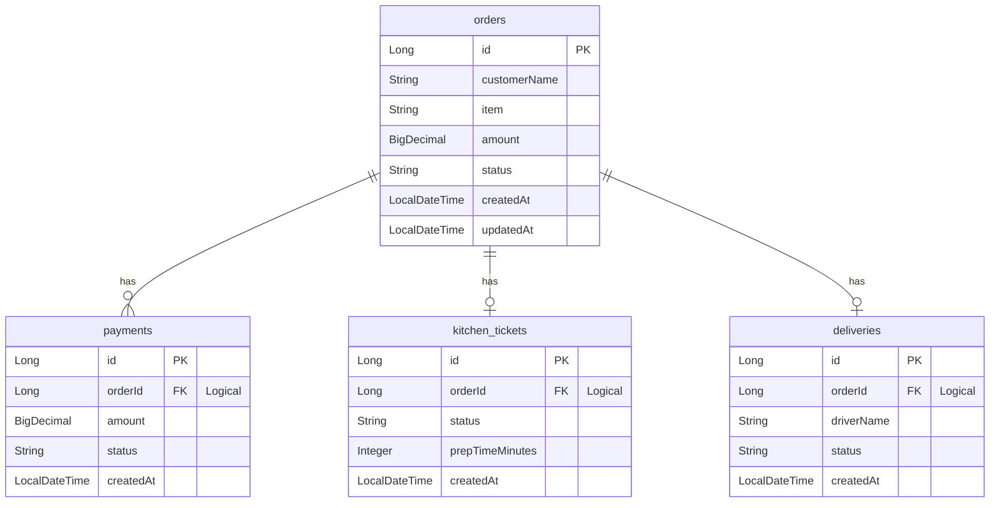

# Database Design

## 1. Database Overview

- **Database Name:** Food Order System (microservices typically utilize separate schemas or a shared schema like `food_order_db` based on Spring `application.yml` configs)
- **Purpose:** To persist the state, transactional history, and lifecycle of food orders across different domain boundaries (Order, Payment, Kitchen, Delivery).
- **Storage Engine:** MySQL (InnoDB by default)

---

## 2. Tables

### 2.1 Table: `orders`
- **Description:** Central repository for all customer food orders. Maintained by the `order-service`.
- **Columns & Data Types:**
  - `id` (BIGINT)
  - `customerName` (VARCHAR)
  - `item` (VARCHAR)
  - `amount` (DECIMAL)
  - `status` (VARCHAR)
  - `createdAt` (DATETIME)
  - `updatedAt` (DATETIME)
- **Constraints:** `customerName`, `item`, `amount`, `status`, `createdAt`, `updatedAt` are `NOT NULL`.
- **Primary Keys:** `id` (Auto Increment)
- **Foreign Keys:** None.
- **Default Values:** `status` defaults to `"PLACED"`.
- **Indexes:** Primary index on `id`.

### 2.2 Table: `payments`
- **Description:** Records payment processing attempts and outcomes. Maintained by the `payment-service`.
- **Columns & Data Types:**
  - `id` (BIGINT)
  - `orderId` (BIGINT)
  - `amount` (DECIMAL(19, 4))
  - `status` (VARCHAR)
  - `createdAt` (DATETIME)
- **Constraints:** All columns `NOT NULL`.
- **Primary Keys:** `id` (Auto Increment)
- **Foreign Keys:** No hard constraints. Logically links to `orders.id` via `orderId`.
- **Default Values:** None explicitly set in JPA.
- **Indexes:** Primary index on `id`.

### 2.3 Table: `kitchen_tickets`
- **Description:** Tracks food preparation tasks. Maintained by the `kitchen-service`.
- **Columns & Data Types:**
  - `id` (BIGINT)
  - `orderId` (BIGINT)
  - `status` (VARCHAR)
  - `prepTimeMinutes` (INT)
  - `createdAt` (DATETIME)
- **Constraints:** `orderId`, `status`, `createdAt` are `NOT NULL`. `prepTimeMinutes` is nullable.
- **Primary Keys:** `id` (Auto Increment)
- **Foreign Keys:** No hard constraints. Logically links to `orders.id` via `orderId`.
- **Default Values:** None.
- **Indexes:** Primary index on `id`.

### 2.4 Table: `deliveries`
- **Description:** Manages driver assignment and delivery dispatch. Maintained by the `delivery-service`.
- **Columns & Data Types:**
  - `id` (BIGINT)
  - `orderId` (BIGINT)
  - `driverName` (VARCHAR)
  - `status` (VARCHAR)
  - `createdAt` (DATETIME)
- **Constraints:** `orderId`, `status`, `createdAt` are `NOT NULL`. `driverName` is nullable.
- **Primary Keys:** `id` (Auto Increment)
- **Foreign Keys:** No hard constraints. Logically links to `orders.id` via `orderId`.
- **Default Values:** None.
- **Indexes:** Primary index on `id`.

---

## 3. Entity Relationships

Because this is a microservices architecture, the project utilizes **soft foreign keys** (`orderId` fields) instead of hard referential integrity (e.g., no `@ManyToOne` or explicit `FOREIGN KEY` constraints are defined in JPA). 



---

## 4. Status Lifecycle

The state machine for an `Order` strictly flows through the following sequences, enforced by the Camunda BPMN workflow:

**Success Path:**
`PLACED`
↓
`PAYMENT` (Wait 2s, Process Payment)
↓
`KITCHEN` (Wait 2s, Prepare Food)
↓
`DELIVERY` (Wait 2s, Assign Driver)
↓
`DELIVERED` (Final state)

**Failure Path:**
`PLACED`
↓
`PAYMENT` (Wait 2s, Process Payment)
↓
`CANCELLED` (If payment fails)

---

## 5. Database Transactions

### When Records Are Inserted
- **orders:** Inserted immediately when `POST /api/orders` is called in `OrderController`.
- **payments:** Inserted when the `PaymentDelegate` invokes `POST /api/payments/process`.
- **kitchen_tickets:** Inserted when the `KitchenDelegate` invokes `POST /api/kitchen/prepare`.
- **deliveries:** Inserted when the `DeliveryDelegate` invokes `POST /api/delivery/assign`.

### When Statuses Are Updated
- The `Order` entity's `status` column is updated actively throughout the Camunda workflow. 

### Which Delegates Modify the Database
To ensure real-time visibility for the React polling mechanism, every delegate opens a **new, isolated transaction** (`Propagation.REQUIRES_NEW`) to commit its status update immediately before triggering its respective external service.
- **`PaymentDelegate`:** Updates `orders` table status to `PAYMENT`.
- **`KitchenDelegate`:** Updates `orders` table status to `KITCHEN`.
- **`DeliveryDelegate`:** Updates `orders` table status to `DELIVERY`.
- **`UpdateOrderStatusDelegate`:** Updates `orders` table status to `DELIVERED`.
- **`CancelOrderDelegate`:** Updates `orders` table status to `CANCELLED`.

---

## 6. Data Flow

```text
React (Client)
  ↓ [POST /api/orders]
Order Service (Controller)
  ↓ [Spring Data JPA save()]
MySQL (Insert into `orders`, Status: PLACED)
  ↓ [JmsTemplate convertAndSend()]
ActiveMQ (`order.created` Queue)
  ↓ [@JmsListener onMessage()]
Camunda (Starts `order-process` Workflow)
  ↓ [PaymentDelegate executes]
Payment Service (Insert into `payments`)
  ↓ [If Success -> KitchenDelegate executes]
Kitchen Service (Insert into `kitchen_tickets`)
  ↓ [If Ready -> DeliveryDelegate executes]
Delivery Service (Insert into `deliveries`)
```
